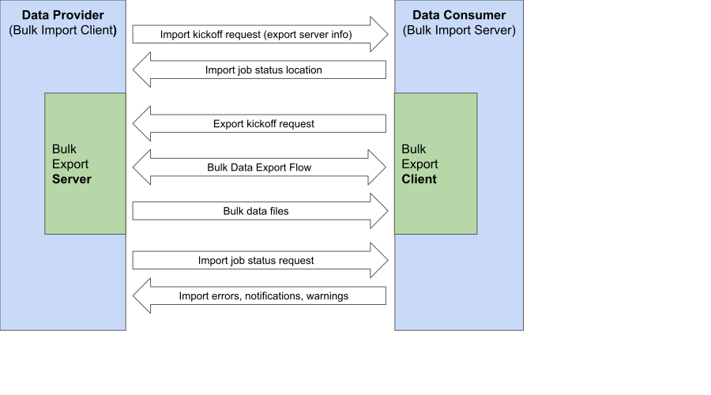

# Bulk Data Import Proposal (Ping and Pull Approach)


|This IG represents a very early stage, draft proposal for a FHIR Bulk Data Import Operation. Feedback is welcome - feel free to open pull requests and issues in this repository, or to join the discussions in the Bulk Data stream on https://chat.fhir.org and the Bulk Data track at FHIR Connectathon events!| 
|:-|


### Audience and Scope

This Bulk Import Operation Implementation Guide is intended to address a variety of use cases where an organization needs to share a large FHIR dataset with another organization or move it between systems within an organization on a schedule defined by the data provider. Inter-organizational examples include submitting FHIR data to a disease specific registry, sending information to a public health institution, or transmitting clinical information to a payor for a quality based payment program. Within a single organization, the operation can be used to coordinate ETL tasks, for example, when a client application wishes to instruct a FHIR server to load a new dataset from a local file server or a cloud storage bucket such as AWS S3.

Servers may wish to address the following activities as part of an import process, however standardization of them is out of scope for the initial release of this implementation guide:
- Incorporation of incremental changes into an existing data set
- De-duplication or merging of data from multiple sources
- Filtering or selective inclusion of specific resources
- Annotating resources such as Patient and Practitioner with master identifiers

Additionally, the scope of this document does not include the legal framework for sharing data between partners that may need to be in place, including Business Associate Agreements, Service Level Agreements, and Data Use Agreements. 

This implementation guide complements the [FHIR Bulk Data Export Operation IG](http://hl7.org/fhir/uv/bulkdata/export/index.html).

### Approach

The flow described below enables an application or service (Data Provider) to indicate to a server (Data Consumer) that a FHIR Bulk Data dataset is available for import and how it can retrieve that dataset - the "ping". The Bulk Data Consumer can then retrieve the dataset using a standard Bulk Data Export flow (or an abbreviated version when retrieving pre-generated, static FHIR bulk data files) - the "pull". Throughout the import process, the Data Provider can request information from the Data Consumer on the status of the import and the Data Consumer can return one or more FHIR OperationOutcome resources describing the import status.

<p></p>

### Security Considerations

All exchanges described herein between a client and a server SHALL be secured using [Transport Layer Security (TLS) Protocol Version 1.2 (RFC5246)](https://tools.ietf.org/html/rfc5246) or a more recent version of TLS.  Use of mutual TLS is OPTIONAL.  

With each of the requests described herein, implementers are encouraged to implement OAuth 2.0 access management in accordance with the [SMART Backend Services: Authorization Guide](https://hl7.org/fhir/uv/bulkdata/authorization/index.html).  Implementations MAY include non-RESTful services that use authorization schemes other than OAuth 2.0, such as mutual-TLS or signed URLs.     

When SMART Backend Services Authorization is used to authorize Data Provider to Data Consumer requests (the initial "ping" and subsequent status checks), the Data Provider will need to be pre-registered with the Data Consumer as a client so the Data Consumer can store the Data Provider's public key information (the key itself or the location of a jwks file) and assign an associated `client_id` for use in the authorization process. When SMART Backend Services Authorization is used to authorize Data Consumer to Data Provider requests (the full or abbreviated Bulk Data Export flow), the Data Consumer will need to be pre-registered with the Data Provider as a client so the Data Provider can store Data Consumer's public key information and assign an associated a `client_id` for use in the authorization process.

These two registrations can be addressed in a single workflow. For example, if a Data Consumer expects a number of Data Providers to register with it, as part of the registration process, the Data Consumer can request a Data Provider's public key information along with a `client_id` that has been associated by the Data Provider with the Data Consumer's documented public key information. Upon completing this registration, the Data Consumer can issue the Data Provider a `client_id` for use in its authorization requests. 

### Request Flow

#### Bulk Data Import Kick-off Request ("ping" from Data Provider to Data Consumer)

The Data Consumer server SHALL support invocation of this operation using the [FHIR Asynchronous Request Pattern](http://hl7.org/fhir/async.html) via a POST request containing a FHIR [Parameters Resource](https://www.hl7.org/fhir/parameters.html).

In this stage of the flow, the Data Provider is acting as a client to the Data Consumer's Bulk Data Import server. 

##### Endpoint

POST `[fhir base]/$import`
  
##### Parameters

-  `exportUrl`  (url, required for client to include)

	The FHIR Parameters resource SHALL include an `exportUrl` parameter with a url containing the kickoff endpoint for a FHIR Bulk Data Export server (if the `exportType` parameters is `dynamic`) OR the location of a FHIR Bulk Data Export manifest file (if the `export_type` is `static`). The supplied parameters MAY include additional FHIR Bulk Data Export kickoff parameters (such as `_type` or `_since`). When these parameters are provided, the Data Consumer SHALL include them in the subsequent export request.

- `exportType` (code, optional for client to include and if omitted defaults to `dynamic`)

	The FHIR Parameters resource MAY include a `exportType` parameter with a string of `static` or `dynamic`. 
  
  If the value is `dynamic` the Data Consumer will issue a POST request to the `exportUrl` to obtain a dataset from the Data Provider, following the Bulk Data Export flow described in the Bulk Data Export IG. 
  
  If the value is `static`, the Data Consumer will issue a GET request to the `exportUrl` to retrieve a Bulk Data Manifest file with the location of the Bulk Data files. In this abbreviated export flow, the Data Provider SHALL respond to the GET request with the Complete Status response described in the Bulk Data Export IG. 

##### Headers

- `Accept` (string, optional for client to include and if omitted defaults to `application/fhir+json`)

  Specifies the format of the optional OperationOutcome resource response to the kick-off request. The client MAY set this header to `application/fhir+json`.

- `Prefer` (string, optional for client to include and if omitted defaults to `respond-async`)

  Specifies whether the response is immediate or asynchronous. The client MAY set this header to `respond-async` [https://tools.ietf.org/html/rfc7240](https://tools.ietf.org/html/rfc7240).

##### Response - Success

- HTTP Status Code of ```202 Accepted```
- ```Content-Location``` header with the absolute URL of an endpoint for subsequent status requests (polling location)
- Optionally, a FHIR OperationOutcome resource in the body

##### Response - Error

- HTTP Status Code of ```4XX``` or ```5XX```
- The body SHALL be a FHIR OperationOutcome resource

If a server wants to prevent a client from beginning a new import before an in-progress import is completed, it SHOULD respond with a `429 Too Many Requests` status and a Retry-After header, following the rate-limiting advice for "Bulk Data Import Status Request" below.

#### Data Retrieval Request ("pull" by Data Consumer of Data Provider)

When the kickoff request `exportType` parameter is `dynamic` the Data Consumer SHALL issue a POST request to the `exportUrl` to obtain a dataset from the Data Provider, following the Bulk Data Export flow described in the Bulk Data Access IG. All valid Bulk Data Export kickoff request parameters included in the Bulk Data Import kickoff request SHALL be reflected back in this request. 

When the kickoff request `exportType` parameter is `static`, the Data Consumer SHALL issue a GET request to the `exportUrl` to to retrieve a Bulk Data Manifest file with the location of the Bulk Data files. In this abbreviated export flow, the Data Provider SHALL respond to the GET request with the Complete Status response described in the Bulk Data Export IG.

This request does not need to be issued immediately following the kickoff request and may be queued by the Data Consumer. However, acceptable timing should be documented and agreed to by the Data Provider and Data Consumer as part of an initial configuration process (e.g., the request will be issued within 24 hours of the kickoff). 

In this stage of the flow, the Data Consumer is acting as a client to the Data Provider's Bulk Data Export server. 

---

#### Bulk Data Import Delete Request (Data Provider to Data Consumer)

After a bulk data import has been initiated, a Data Provider MAY send a DELETE request to the URL provided in the `Content-Location` header to cancel the request. A Data Consumer MAY use the request as a signal that a Data Provider has retrieved all outputs it intends to retrieve, and that it is safe for the Data Consumer to remove those from storage. Following the delete request, when subsequent requests are made to the polling location, the Data Consumer SHALL return a 404 error and an associated FHIR OperationOutcome in JSON format.

In this stage of the flow, the Data Provider is acting as a client to the Data Consumer's Bulk Data Import server.

##### Endpoint

`DELETE [polling content location]`

##### Response - Success

- HTTP Status Code of `202 Accepted`
- Optionally a FHIR OperationOutcome resource in the body

##### Response - Error Status

- HTTP status code of `4XX` or `5XX`
- The body SHALL be a FHIR OperationOutcome resource

---
#### Bulk Data Import Status Request (Data Provider to Data Consumer)

After a bulk data import has been kicked off, the Data Provider MAY poll the status URL provided in the `Content-Location` header.  

Data Providers SHOULD follow an [exponential backoff](https://en.wikipedia.org/wiki/Exponential_backoff) approach when polling for status. Data Consumers SHOULD supply a [Retry-After header](https://developer.mozilla.org/en-US/docs/Web/HTTP/Headers/Retry-After) with a http date or a delay time in seconds. When provided, Data Providers SHOULD use this information to inform the timing of future polling requests. Data Consumers SHOULD keep an accounting of status queries received from a given Data Provider, and if a Provider is polling too frequently, the server SHOULD respond with a `429 Too Many Requests` status code in addition to a Retry-After header, and optionally a FHIR OperationOutcome resource with further explanation.  If excessively frequent status queries persist, the server MAY return a `429 Too Many Requests` status code and terminate the session. Other standard HTTP `4XX` as well as `5XX` status codes may be used to identify errors as mentioned.

When requesting status, the Data Providers SHOULD use an `Accept` header indicating a content type of  `application/json`. In the case that errors prevent the import from completing, the Data Consumer SHOULD respond with a FHIR OperationOutcome resource in JSON format.

In this stage of the flow, the Data Provider is acting as a client to the Data Consumer's Bulk Data Import server.

##### Endpoint

`GET [polling content location]`

**Responses**

<table class="table">
  <thead>
    <th>Response Type</th>
    <th>Description</th>
    <th>Example Response Headers + Body</th>
  </thead>
  <tbody>
    <tr>
      <td><a href="#response---in-progress-status">In-Progress</a></td>
      <td>Returned by the Data Consumer while it is processing the $import request.</td>
      <td><pre><code>Status: 202 Accepted
X-Progress: “Retrieving export files”
Retry-After: 120</code></pre></td>
    </tr>
    <tr>
      <td><a href="#response---error-status-1">Error</a></td>
      <td>Returned by the Data Consumer if the import operation fails.</td>
      <td><pre><code>Status: 500 Internal Server Error
Content-Type: application/json

{
&nbsp;"resourceType": "OperationOutcome",
&nbsp;"id": "1",
&nbsp;"issue": [
&nbsp;&nbsp;{
&nbsp;&nbsp;&nbsp;"severity": "error",
&nbsp;&nbsp;&nbsp;"code": "processing",
&nbsp;&nbsp;&nbsp;"details": {
&nbsp;&nbsp;&nbsp;&nbsp;"text": "An internal timeout has occurred"
&nbsp;&nbsp;&nbsp;}
&nbsp;&nbsp;}
&nbsp;]
}</code></pre></td>
    </tr>
    <tr>
      <td><a href="#response---complete-status">Complete</a></td>
      <td>Returned by the Data Consumer when the import operation has completed.</td>
      <td><pre><code>Status: 200 OK
Expires: Mon, 22 Jul 2019 23:59:59 GMT
Content-Type: application/json

{
&nbsp;"transactionTime": "2021-01-01T00:00:00Z",
&nbsp;"requiresAccessToken" : true,
&nbsp;"outcome" : [{
&nbsp;&nbsp;"type" : "OperationOutcome",
&nbsp;&nbsp;"url" : "https://example.com/output/info_file_1.ndjson"
&nbsp;}],
&nbsp;"extension":{"https://example.com/extra-property": true}
}</code></pre></td>
    </tr>
  </tbody>
</table>


##### Response - In-Progress Status

- HTTP Status Code of `202 Accepted`
- Optionally, the Data Consumer MAY return an `X-Progress` header with a text description of the status of the request that's less than 100 characters. The format of this description is at the server's discretion and may be a percentage complete value, or a more general status such as "in progress". The Data Provider MAY parse the description, display it to the user, or log it.

##### Response - Error Status

- HTTP status code of `4XX` or `5XX`
- `Content-Type` header of `application/fhir+json` when body is a FHIR `OperationOutcome` resource
- The body of the response SHOULD be a FHIR `OperationOutcome` resource in JSON format. If this is not possible (for example, the infrastructure layer returning the error is not FHIR aware), the Data Consumer MAY return an error message in another format and include a corresponding value for the `Content-Type` header.

In the case of a polling failure that does not indicate failure of the import job, a Data Consumer SHOULD use a [transient code](https://www.hl7.org/fhir/codesystem-issue-type.html#issue-type-transient) from the [IssueType valueset](https://www.hl7.org/fhir/codesystem-issue-type.html) when populating the OperationOutcome ```issue.code``` to indicate to the Data Provider that it should retry the request at a later time.

*Note*: Even if some of the requested resources cannot successfully be imported, the overall import operation MAY still succeed. In this case, the `Response.outcome` array of the completion response body SHALL be populated with one or more files in ndjson format containing FHIR `OperationOutcome` resources to indicate what went wrong (see below). In the case of a partial success, the Data Consumers SHALL use a 200 status code instead of 4XX or 5XX. The choice of when to determine that an import job has failed in its entirety (error status) vs returning a partial success (complete status) is left up to the implementer.

##### Response - Complete Status

- HTTP status of `200 OK`
- `Content-Type` header of `application/json`
- The server MAY return an `Expires` header indicating when the files listed will no longer be available for access.
- A body containing a JSON object providing metadata, and links to the generated bulk data import status files.  The files SHALL be accessible to the client at the URLs advertised. These URLs MAY be served by file servers other than a FHIR-specific server.

Required Fields:

<table class="table">
  <thead>
    <th>Field</th>
    <th>Optionality</th>
    <th>Type</th>
    <th>Description</th>
  </thead>
  <tbody>
    <tr>
      <td><code>transactionTime</code></td>
      <td><span class="label label-success">required</span></td>
      <td>FHIR instant</td>
      <td>Indicates the time when the import was initiated.
      </td>
    </tr>
    <tr>
      <td><code>requiresAccessToken</code></td>
      <td><span class="label label-success">required</span></td>
      <td>Boolean</td>
      <td>Indicates whether downloading the generated files requires the same authentication scheme as the import operation itself
      <br/>
      <br/>
      Value SHALL be <code>true</code> if both the file server and the FHIR API server control access using OAuth 2.0 bearer tokens. Value MAY be <code>false</code> for file servers that use access-control schemes other than OAuth 2.0, such as downloads from Amazon S3 bucket URLs or verifiable file servers within an organization's firewall.
      </td>
    </tr>
    <tr>
      <td><code>outcome</code></td>
      <td><span class="label label-success">required</span></td>
      <td>Array</td>
      <td>
	  	Array of one or more ndjson files containing OperationOutcome resources.
      	<br/><br/>
        Error, warning, and information messages related to the import should be included here. If there are no relevant messages, the server SHOULD return an empty array. Only the <code>OperationOutcome</code> resource type is currently supported, and.<br/><br/>
        If the request contained invalid or unsupported parameters along with a <code>Prefer: handling=lenient</code> header and the server processed the request, the server SHOULD include an OperationOutcome resource for each of these parameters.
      	<br/><br/>
        Each file item SHALL contain a <code>url</code> field containing the path to the file.
        <br/><br/>
        Each file item MAY optionally contain a <code>count</code> field with the number of resources in the file, represented as a JSON number.
        <br/><br/>
        Note that field corresponds to the `error` field in the export operation manifest and has been renamed to reflect its use for informational and warning level OperationOutcome messages.
      </td>
    </tr>
    <tr>
      <td><code>extension</code></td>
      <td><span class="label label-info">optional</span></td>
      <td>JSON Object</td>
      <td>To support extensions, this implementation guide reserves the name <code>extension</code> and will never define a field with that name, allowing server implementations to use it to provide custom behavior and information. For example, a server may choose to provide a custom extension that contains a decryption key for encrypted ndjson files. The value of an extension element SHALL be a pre-coordinated JSON object.
      <br/>
      <br/>
      Note: In addition to extensions being supported on the root object level, extensions may also be included within the fields above (e.g., in an item in an 'outcome' object).
      </td>
    </tr>
  </tbody>
</table>

Example response body:

```json
  {
    "transactionTime": "2021-01-01T00:00:00Z",
    "requiresAccessToken" : true,
    "outcome" : [{
      "url" : "https://example.com/output/err_file_1.ndjson"
    }],
    "extension":{"https://example.com/extra-property": true}
  }
```

---
#### Outcome File Request (Data Provider to Data Consumer)

Using the URLs supplied by the FHIR server in the Complete Status response body's `outcome` field, a client MAY download any `OperationOutcome` results as bulk data files within the time period specified in the `Expires` header (if present). If the `requiresAccessToken` field in the Complete Status body is set to `true`, the request SHALL include a valid access token.  See the Security Considerations section above.  


##### Endpoint

`GET [url from status request output field]`

##### Headers

- `Accept` (string, optional for client to include and if omitted defaults to `application/fhir+json`)

Specifies the format of the file being requested.

##### Response - Success

- HTTP status of `200 OK`
- `Content-Type` header that matches the file format being delivered.  For files in ndjson format, SHALL be `application/fhir+ndjson`
- Body of FHIR `OperationOutcome` resources in newline delimited json - [ndjson](http://ndjson.org/) or other requested format

##### Response - Error

- HTTP Status Code of `4XX` or `5XX`
